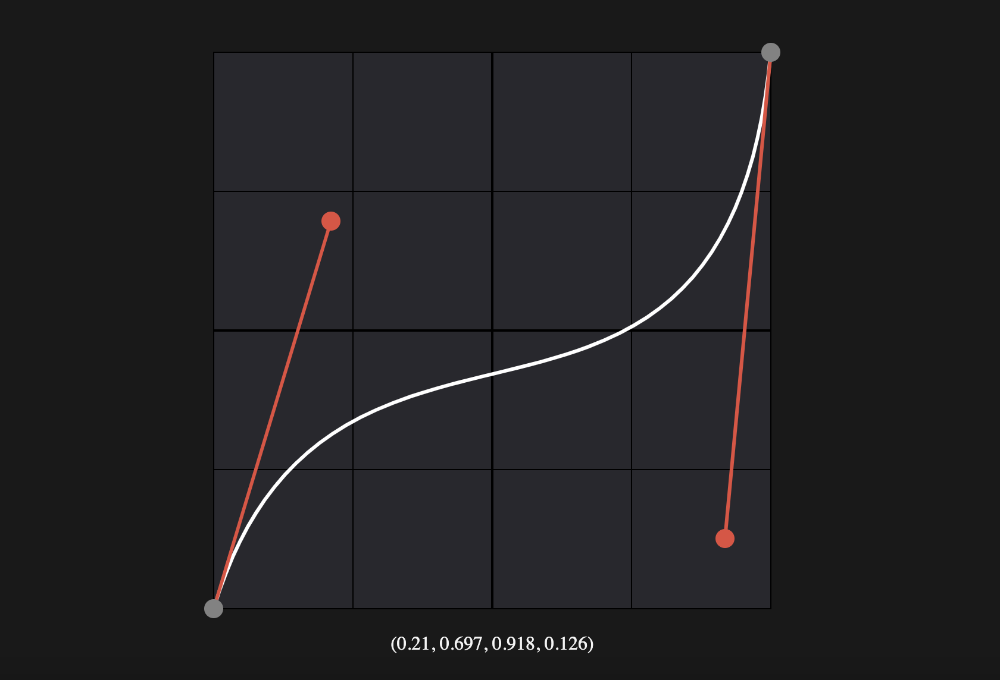

# Typescript React Bezier Editor

[](https://www.npmjs.com/package/ts-bezier-easing-editor)
[](https://github.com/ikcede/ts-bezier-easing-editor/blob/main/LICENSE)


A Typescript implementation of a bezier editor React component for the CSS easing function. Click and drag the knobs to visually modify your beziers!



If you like this, please give the project a GitHub 🌟

## Demo & Docs

Check out the [live Storybook instance](https://ikcede.github.io/ts-bezier-easing-editor/?path=/docs/components-beziereditor--docs) for a demo and docs of all the props.

## Installation

```sh
npm install ts-bezier-easing-editor
```

## Usage

1. Import the `BezierEditor` component

```tsx
import { BezierEditor } from 'ts-bezier-easing-editor';
```

2. Now you can use the editor component in your tsx

```tsx
<BezierEditor {[...props]}></BezierEditor>
```

Check out [example/App.tsx](https://github.com/ikcede/ts-bezier-easing-editor/blob/main/example/App.tsx) for a simple example

## Work in Progress

* Configure for extended Y coordinates
* Improve test coverage
* Fix position calculation with CSS zoom applied

## Local Development

If you wish to fork the repo, after installing the deps, you can run these scripts:

### `npm start`

Runs the app in the development mode.
Open [http://localhost:3000](http://localhost:3000) to view it in the browser.

**Note**: This runs the App files in example/ as the dev environment.

The page will reload if you make edits.
You will also see any lint errors in the console.

### `npm test`

Runs tests in Jest

### `npm run build`

Using `vite-build.config.ts`, compiles and exports the TS library into `dist/main.js` and `dist/main.d.ts`.

### `npm run storybook`

Starts up a Storybook server on [http://localhost:6006](http://localhost:6006)

### `npm run build-storybook`

Builds a static web app version of Storybook to `/storybook-static`

